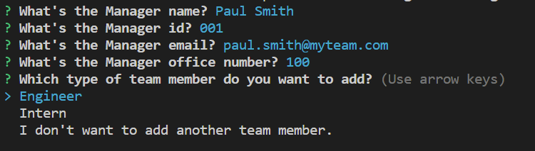
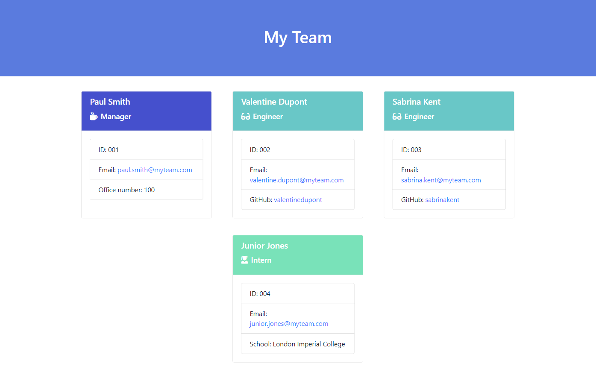

# team-profile-generator

## Description

This command line appliccation takes in information about employees on a software engineering team, then generate an HTML webpage that displays summaries for each person. 

## Table of Contents

- [Installation](#installation)
- [Usage](#usage)
- [Credits](#credits)
- [License](#license)

## Installation

- Fork this repository
- Clone the repository on your local machine
- Open the project folder and the terminal
- Install the required depedencies:
```
npm install
```

## Usage

- Run the application:
```
node index.js
```
- Follow the prompts to enter the team member's information starting with the manager information. Then choose what type of Team member you want to add using the arrow keys and enter their information. Once you have completed the Team, choose "I don't want to add another team member" to generate the HTML webpage "team.html" inside the output folder.



Example of a generated HTML webpage using the application:

[Team HTML webpage](output/team.html)




## Credits

N/A 

## License

MIT License
